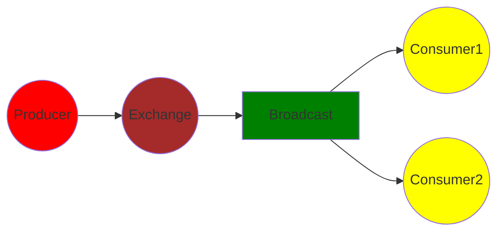

# celery的消息广播
## celery的广播图

上面是celery的一个广播特性的图，可以看到celery是通过生产者(producer)，把消费发送给交换机(Exchange), 交换机把消息发送给广播队列(Broadcast)，然后由消费者(Consumer1)开始消费。这里**广播**的意思，即Consumer1,Consumer2会消费同样的消息。下面是celery广播的具体实现demo，供参考


## 启动一个celery worker
app1.py
```python
from celery import Celery
from kombu.common import Broadcast

celery_app = Celery()


RABBITMQ_CONFIG = {
    "protocal": "pyamqp://",
    "user": "extract_task",
    "password": "extract_task_pwd",
    "host": "rabbitmq",
    "vhost": "extract_task"
}


class CeleryConfig:
    broker_url = "{protocol}{user}:{password}@{host}/{vhost}".format(
        protocol=RABBITMQ_CONFIG["protocal"],
        user=RABBITMQ_CONFIG["user"],
        password=RABBITMQ_CONFIG["password"],
        host=RABBITMQ_CONFIG["host"],
        vhost=RABBITMQ_CONFIG["vhost"],
    )

    timezone = "Asia/Shanghai"
    enable_utc = False
    accept_content=["json"]
    worker_max_tasks_per_child = 100
    task_soft_time_limit = 600
    task_default_queue = "default"
    
    task_queues = (Broadcast(name="bcast"),)
    task_routes = {
        "test_cache": {
            "queue": 'bcast',
            "exchange": 'bcast'
        }
    }

celery_app.config_from_object(CeleryConfig)


@celery_app.task(name="test_cache")
def myfunc():
    print("ssssssssssssssssssssssssssss")

```
通过下面命令启动一个celery worker
```shell
celery -A tasks.app1 worker --loglevel=INFO -Q bcast
```
上面是一个celery worker代码，启动一个celery worker消费者，监听来自bcast队列的消息，bcast的队列是个广播队列


## 启动另外一个celery worker
app2.py
```python
from celery import Celery
from kombu.common import Broadcast

celery_app = Celery()


RABBITMQ_CONFIG = {
    "protocal": "pyamqp://",
    "user": "extract_task",
    "password": "extract_task_pwd",
    "host": "rabbitmq",
    "vhost": "extract_task"
}


class CeleryConfig:
    broker_url = "{protocol}{user}:{password}@{host}/{vhost}".format(
        protocol=RABBITMQ_CONFIG["protocal"],
        user=RABBITMQ_CONFIG["user"],
        password=RABBITMQ_CONFIG["password"],
        host=RABBITMQ_CONFIG["host"],
        vhost=RABBITMQ_CONFIG["vhost"],
    )

    timezone = "Asia/Shanghai"
    enable_utc = False
    accept_content=["json"]
    worker_max_tasks_per_child = 100
    task_soft_time_limit = 600
    task_default_queue = "default"
    
    task_queues = (Broadcast(name="bcast"),)
    task_routes = {
        "test_cache": {
            "queue": 'bcast',
            "exchange": 'bcast'
        }
    }

celery_app.config_from_object(CeleryConfig)


@celery_app.task(name="test_cache")
def myfunc1():
    print("fffffffffffffffffffffffffffff")

```
通过下面命令启动一个celery worker
```shell
celery -A tasks.app2 worker --loglevel=INFO -Q bcast
```
上面是一个celery worker代码，启动另外一个celery worker消费者，监听来自bcast队列的消息，bcast的队列是个广播队列


# celery生产者
```shell
In [5]: from tasks.app import celery_app

In [6]: from kombu.common import Broadcast

In [7]: queue = Broadcast(name="bcast")

In [8]: celery_app.send_task("test_cache", queue=queue)
```
通过上面的shell交互环境，启动一个celery生产者，并向bcast广播队列发送一条消息

最后可以看到，2个celery worker分别同时消费一个消息