# 后端面试流程归纳总结
## 概述
  面试是一件非常严肃的事情，几方面来说:1.为公司选择能力满足公司开发需求的人，这是为公司负责; 2.出来找工作都不容易，面试者也希望进入一家好的公司，能和公司一起成长，这是为被面试者负责；3.如果招聘进来的人，最后发现因为面试比较水，而蒙混过关，在实际工作合作的时候，会发现非常痛苦，这是为自己负责。以下是在下归纳总结的面试流程和面试问题。问题和流程都会根据实际情况持续更新。面试从当前**技术能力(50%)**,**沟通能力(20%)**,**学习能力(15%)**,**服务能力(15%)**,四个维度考察。面试原则，**在满足基本用人要求的情况下，尽可能挖掘被面试者的亮点**。
## 面试题基本流程
### 0.看候选人简历
  大概扫一眼候选人的项目经历和技能特点，擅长什么。对候选人有个初步了解。
### 1.请面试者做基本介绍(必选)
  一般常规问题，主要看下面试者的语言表达能力，初步的沟通能力。这里要求面试官和蔼可亲，至少面带笑容，给候选人呈现出一种比较**轻松的氛围**，期待候选人不会因为太紧张，不能发挥水平。
### 2.热场
  一般来说，通过做自我介绍，如果面试者比较紧张，可能自我介绍很短，为了能让面试者更能发挥自己水平，回归平常心，需要一些问题，需要一些问题激发他的表达欲
#### 2.1 询问面试者自己的优点和缺点
#### 2.2 询问面试者有没有获得过个人奖项
### 3.技术面试问题(必选)
  技术面试流程，最好以时间排序，让候选人介绍最近所做项目开始，
#### 3.1 面试面试者所做项目
  考察被面试者的的语言表达能力，这里关注项目的**功能，模块，职责角色**等
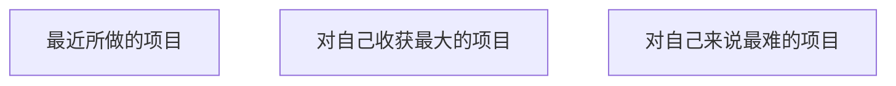
#### 3.2 开放式摸底问题
  开放式问题，可以回答得非常简单，也可以非常复杂，通过该问题摸清被面试者技术水平所处层次(**初级，中级，高级**)，我在这里针对不同水平层次的面试者，准备了3套题目，可以认为从左到右，依次对应**初级，中级，高级**
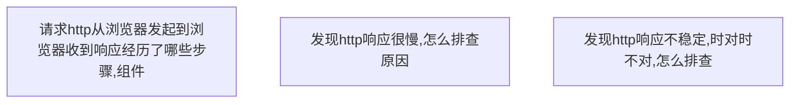

#### 3.3 数据,存储与缓存
存储与缓存作为现代web开发的以数据为核心的理念，作为首先必须问的问题。
##### 3.3.1 redis的问题
   
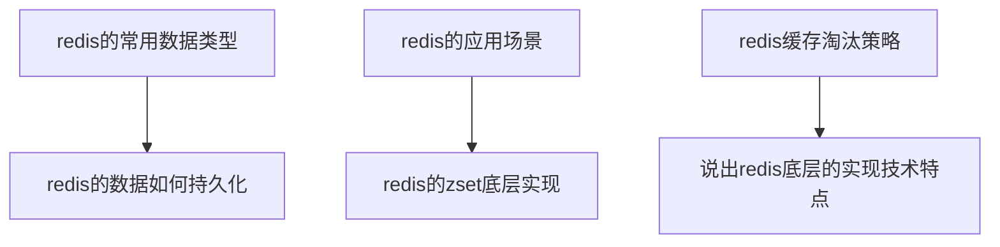
##### 3.3.2 mysql的问题
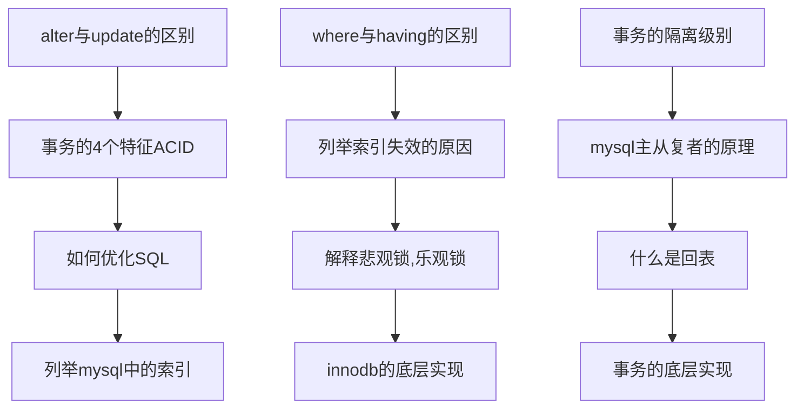
##### 3.3.3 缓存和数据库
缓存是个非常宽泛的概念，从CPU的L1 L2 L3 cache, nginx文件缓存, redis缓存, 程序上下文缓存, CDN技术，http cache, 这些都是缓存 这里主要考察面试者对缓存理解到哪个技术层次
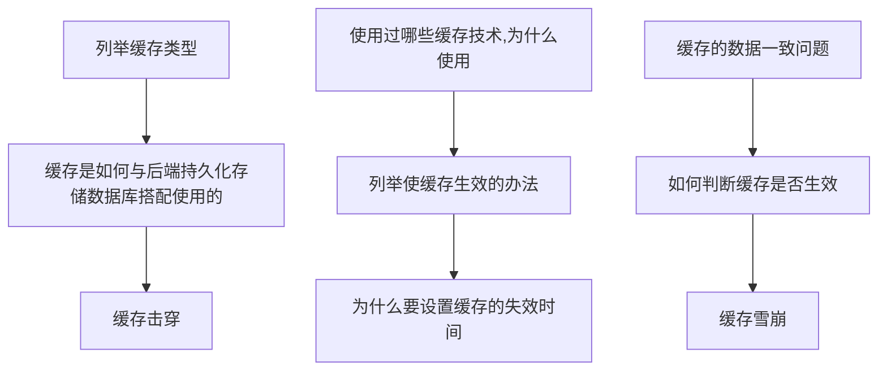
#### 3.4 python的问题
这里主要考察python的问题，其中装饰器为必考内容，然后针对不同水平的python开发者，选择难度适宜的问题。
##### 3.4.1 一般python问题
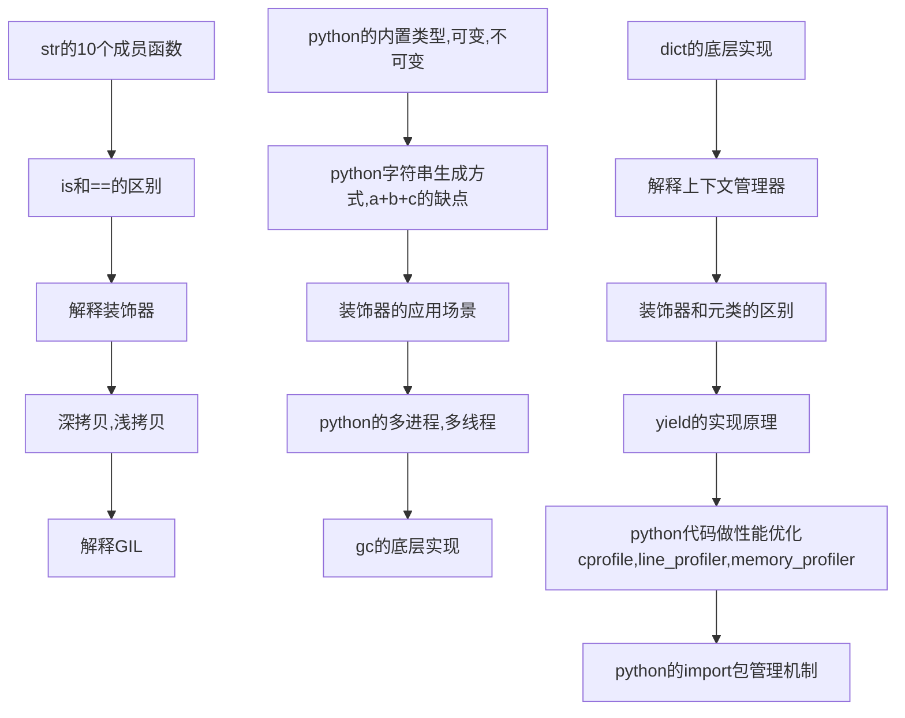
##### 3.4.2 python web或者其他python应用
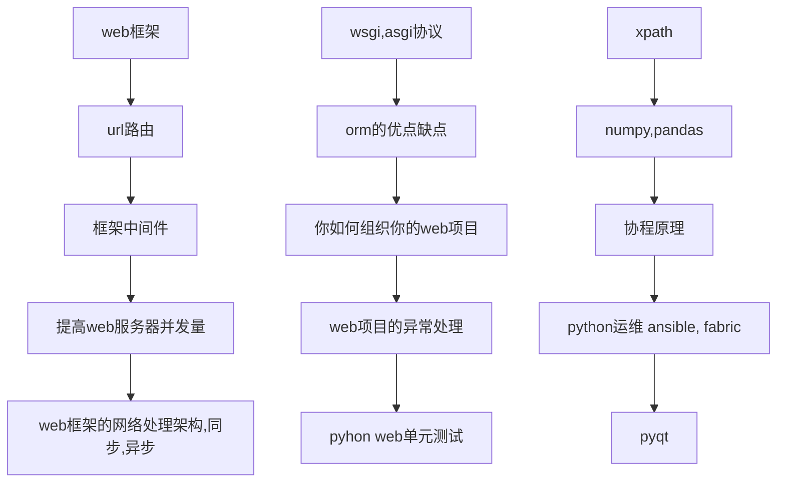

#### 3.5 Celery/rabbitmq问题
  Celery作为python编写的一个简单、灵活且可靠、处理大量消息的分布式系统，在处理耗时很长的阻塞任务，几乎是python唯一选择。而后端的broker可以采用RabbitMQ等消息队列实现。
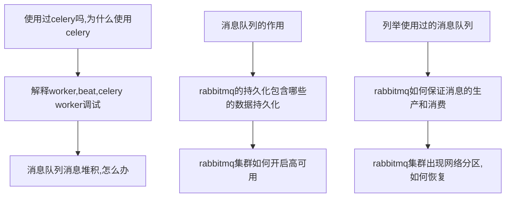
#### 3.6 网络，网络协议问题
  TCP/IP的问题一般比较基础，任何一本TCP/IP书籍都有详细阐述，但是因为工作原因，部分开发可能忘记了部分细节，我觉得这是可以理解的，但是面试者既然知道来面试，我觉得花点时间把这部分知识重新看一下，并不过分。
##### 3.6.1 TCP/IP协议
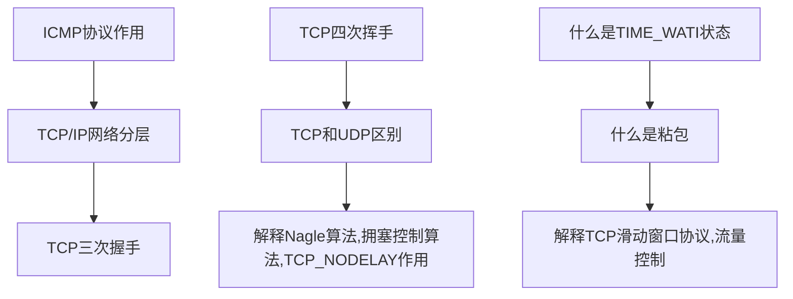

##### 3.6.2 HTTP相关问题
  HTTP协议是我们重点考察的部分, 核心是RESTFUL。
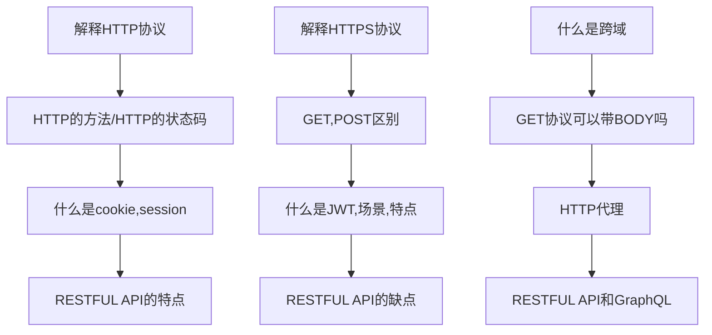

#### 3.7 linux,虚拟化技术
   因为后台工作的关系，要求必须会使用linux，这里主要从一般命令使用，考察面试者如何查看，分析linux文件日志，管理日志入手，看面试者对linux熟悉程度。
#### 3.7.1 虚拟化docker问题
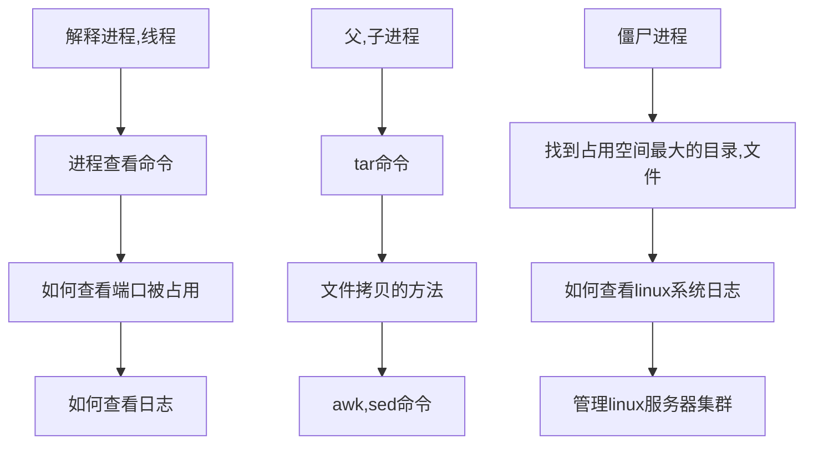

#### 3.7.2 虚拟化docker问题
   当前后端开发，虚拟化docker容器技术已经成为主流，不再神秘，这里要求必须会docker。
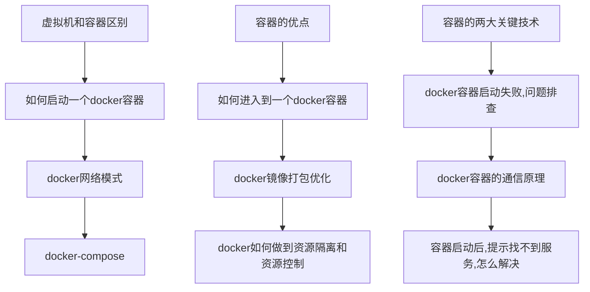

#### 3.8 分布式，微服务，架构问题(可选)
   分布式，微服务等服务器技术已经被越来越多公司采用，针对中高级开发，需要问架构问题。

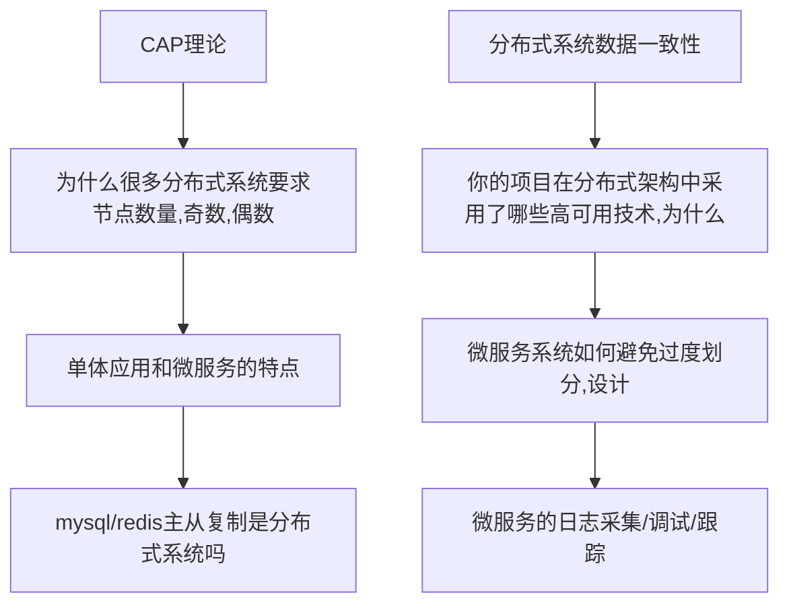

### 4.请介绍自己满意的项目(可选)
  如果在前面技术面试中，可能因为候选人的项目经历和面试官本身熟悉的技术领域和方向不太匹配，这里可以给候选人一个机会，来弥补介绍自己的机会
### 5.询问面试者有什么问题(必选)
  作为面试快结束的标志。这里需要注意，不要随便对候选人做什么承诺，或者对公司不切实际的描述，不涉密。
## 结语
  上次归纳总结面试题，那套面试题已经使用了3年，客观地说，那套题目对于招聘一个中级开发者来说，效果还是相当不错的，但是随着市场行情开发者的平均水平提高，那套题目已经越来越不合时宜了，有必要提高题目难度，做到与时俱进。这次新编辑这套题目，考虑了初，中，高三个级别的面试者，并且增加了程序架构的题，应该来说，对招聘高级开发更加友好，起到一定指导作用。