# 后端面试流程归纳总结
## 概述
  面试是一件非常严肃的事情，几方面来说:
1. 为公司选择能力满足公司开发需求的人，这是**为公司负责**;
2. 出来找工作都不容易，面试者也希望进入一家好的公司，能和公司一起成长，这是**为被面试者负责**；
3. 如果招聘进来的人，最后发现因为面试比较水，而蒙混过关，在实际工作合作的时候，会发现非常痛苦，这是**为自己负责**。

以下是在下归纳总结的面试流程和面试问题。问题和流程都会根据实际情况持续更新。这里分四个维度，两个原则。

  四个维度:
  + **技术能力(50%)**
  + **沟通能力(20%)**
  + **学习能力(15%)**
  + **服务能力(15%)**
  
  两个原则:
  + **在满足基本用人要求的情况下，尽可能挖掘被面试者的亮点**。
  + **题目需要有区分度，针对不同级别的面试者，分为初，中，高级**。

  可以简单先以工作年限对应题目级别
 工作年限 | 题目级别 | 出题原则
-------- | -----| ----- | --------
1-3年    | 初级 | 知道概念，能够简单使用 |
3-5年 | 中级 | 文复杂应用，并且对底层有一定了解 |
6年以上 | 高级 | 知道部分领域底层原理，底层实现 |

## 面试题基本流程
### 0.看候选人简历
  大概扫一眼候选人的项目经历和技能特点，擅长什么。对候选人有个初步了解。
### 1.请面试者做基本介绍(必选)
  一般常规问题，主要看下面试者的语言表达能力，初步的沟通能力。这里要求面试官和蔼可亲，至少面带笑容，给候选人呈现出一种比较**轻松的氛围**，期待候选人不会因为太紧张，不能发挥水平。
### 2.热场(可选)
  一般来说，通过做自我介绍，如果面试者比较紧张，可能自我介绍很短，为了能让面试者更能发挥自己水平，回归平常心，需要一些问题，需要一些问题激发他的表达欲
#### 2.1 询问面试者自己的优点和缺点(可选)
#### 2.2 询问面试者有没有获得过个人奖项(可选)
### 3.技术面试问题(必选)
  技术面试流程，先从编程基础开始。

#### 3.1
这里主要考察python的问题，其中装饰器为必考内容，然后针对不同水平的python开发者，选择难度适宜的问题。
##### 3.1.1 一般python问题
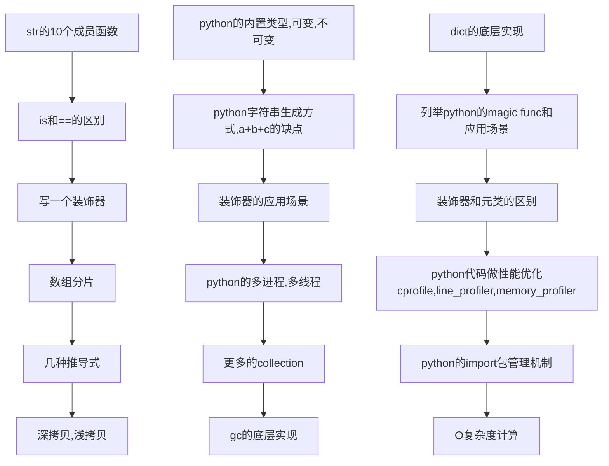

#### 3.2 开放式摸底问题
  开放式问题，可以回答得非常简单，也可以非常复杂，通过该问题摸清被面试者技术水平所处层次(**初级，中级，高级**)。
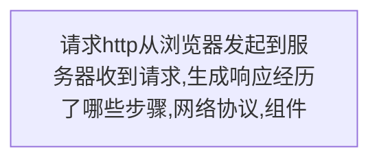
### 3.3 计算机网络网络，网络协议问题
#### 3.3.1 网络HTTP问题/python web问题
  结合上面一个http请求问题，可以引申到HTTP+python web的问题。
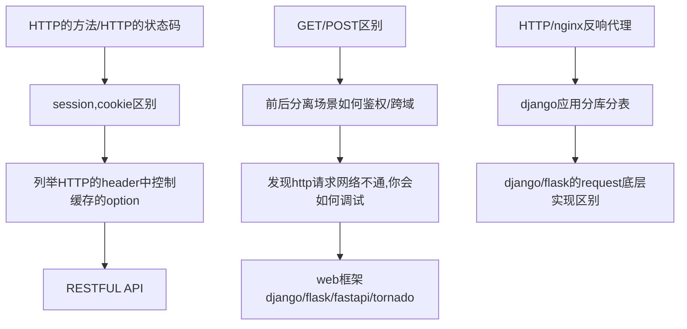
##### 3.3.2 TCP/IP协议(可选)
   TCP/IP的问题一般比较基础，任何一本TCP/IP书籍都有详细阐述，但是因为工作原因，部分开发可能忘记了。根据过往面试经验，一般只有过运维或者搞过C/C++开发的，对这部分较熟悉。
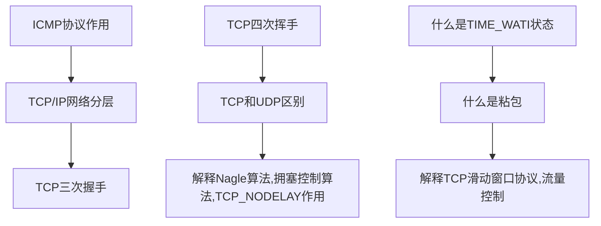

#### 3.4 存储/队列
存储数据库和消息队列作为现在程序开发中，最常见的开发组件，可以针对面试者简历，选择其中2-3个组件问。
##### 3.4.1 redis的问题
   
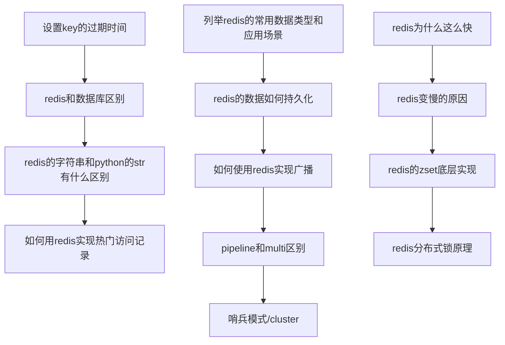
##### 3.4.2 mysql的问题
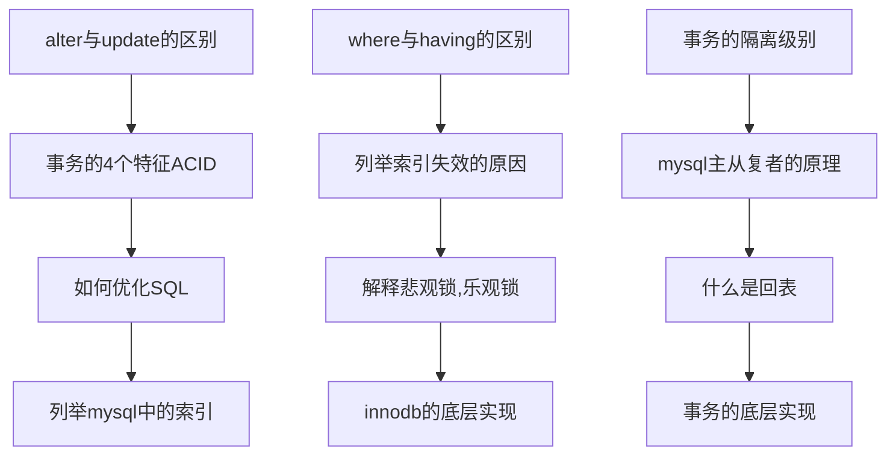
##### 3.4.3 mongodb的问题(可选)
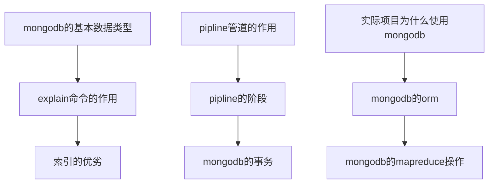

##### 3.4.4 elasticsearch的问题(可选)
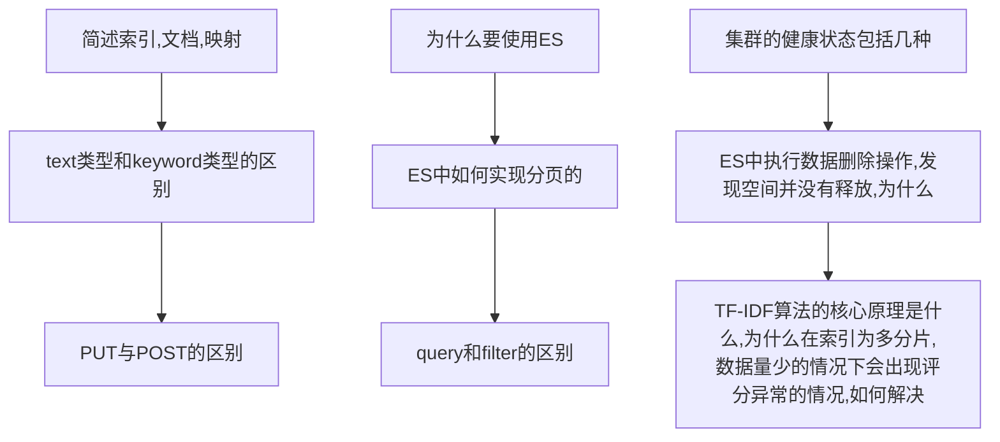

##### 3.4.5 rabbitmq的问题(可选)
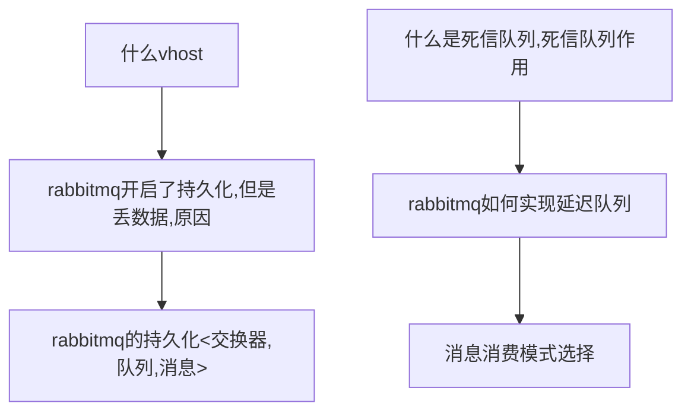

##### 3.4.6 kafka的问题(可选)
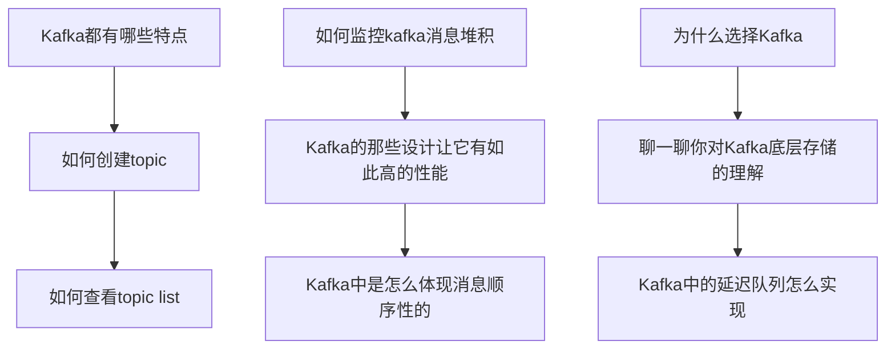

#### 3.6 linux,虚拟化技术
   因为后台工作的关系，要求必须会使用linux，这里主要从一般命令使用，考察面试者如何查看，分析linux文件日志，管理日志入手，看面试者对linux熟悉程度。
#### 3.6.1 linux问题
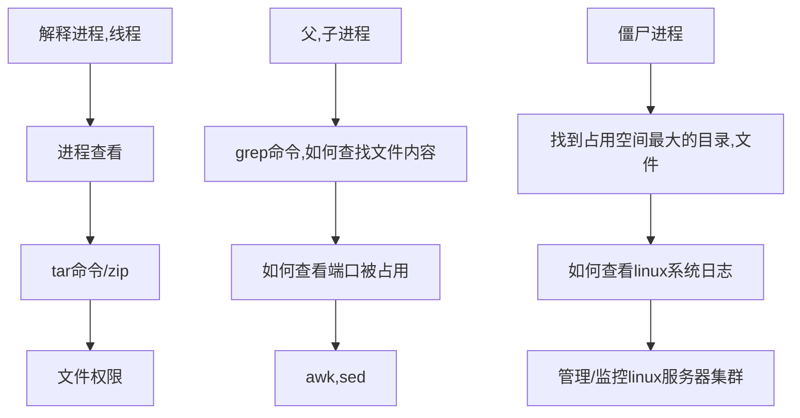

#### 3.6.2 docker问题
   当前后端开发，docker容器技术已经成为主流，不再神秘，这里要求必须会docker，针对中高级，可以增加k8s的问题。
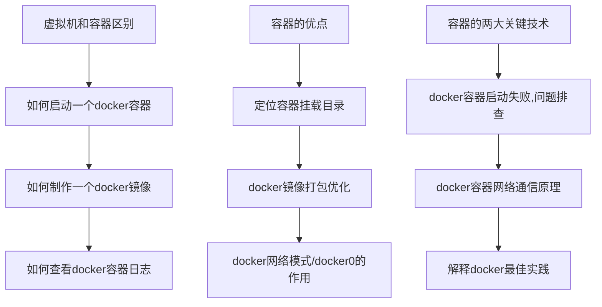

#### 3.8 分布式，微服务，架构问题(可选)
   分布式，微服务等服务器技术已经被越来越多公司采用，针对中高级开发，需要问架构问题。

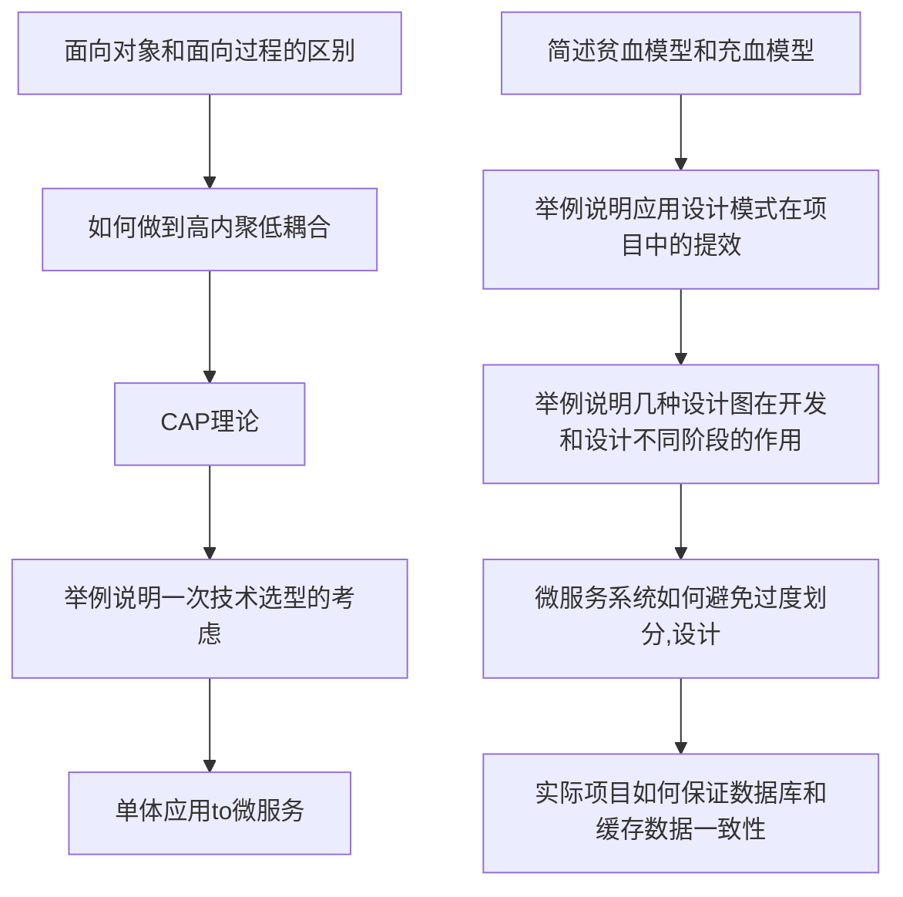

#### 3.9 算法笔试(可选)
   算法这块，我个人觉得口头阐述，不如直接编辑器编写，这里为了控制时间，要控制好难度，最好15-20分钟内写完。
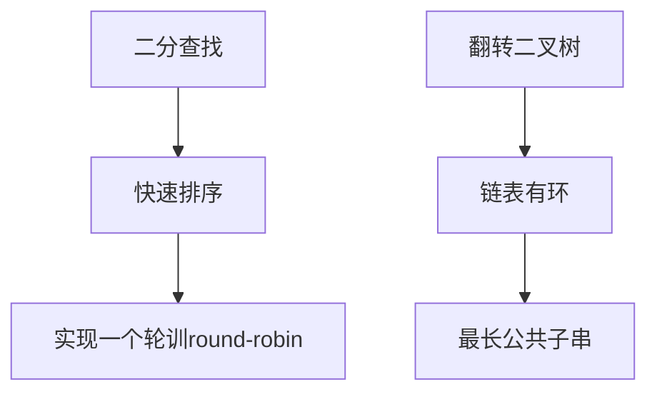

### 4.请介绍自己满意的项目(可选)
  如果在前面技术面试中，可能因为候选人的项目经历和面试官本身熟悉的技术领域和方向不太匹配，这里可以给候选人一个机会，来弥补介绍自己的机会。
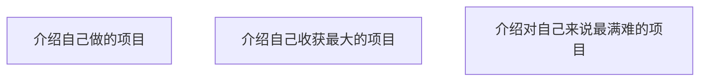
### 5.询问面试者有什么问题(必选)
  作为面试快结束的标志。这里需要注意，不要随便对候选人做什么承诺，或者对公司不切实际的描述，不涉密。
## 结语
  上次归纳总结面试题，那套面试题已经使用了3年，客观地说，那套题目对于招聘一个中级开发者来说，效果还是相当不错的，但是随着市场行情开发者的平均水平提高，那套题目已经越来越不合时宜了，有必要提高题目难度，做到与时俱进。这次新编辑这套题目，考虑了初，中，高三个级别的面试者，并且增加了程序架构的题，应该来说，对招聘高级开发更加友好，起到一定指导作用。