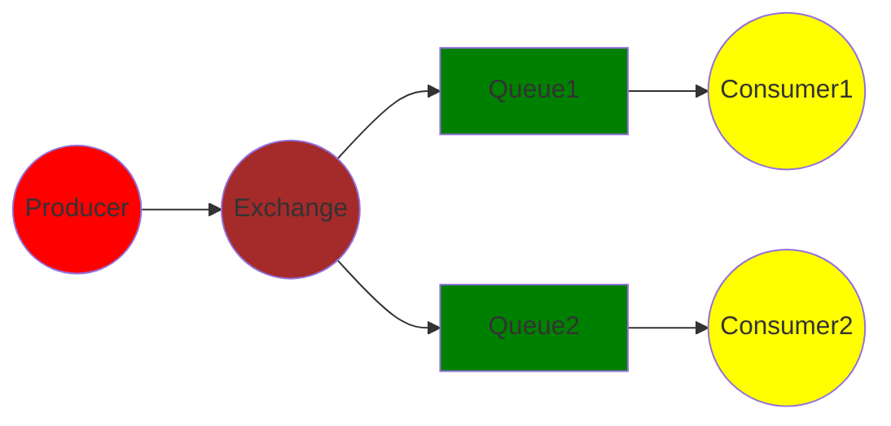

# rabbitmq广播完整特性例子

## rabbitmq广播图

上面是rabbitmq的一个广播特性的图，可以看到rabbitmq是通过生产者(producer)，把消费发送给交换机(Exchange), 交换机把消息发送给监听了exchange扇区的所有队列，然后由不同的消费者去各自的队列取到消息。下面是一个rabbitmq广播特性的demo。


## 启动一个celery worker
app1.py
```python
from celery import Celery
from kombu.common import Broadcast, Queue, Exchange


celery_app = Celery()


RABBITMQ_CONFIG = {
    "protocal": "pyamqp://",
    "user": "extract_task",
    "password": "extract_task_pwd",
    "host": "rabbitmq",
    "vhost": "extract_task"
}


class CeleryConfig:
    broker_url = "{protocol}{user}:{password}@{host}/{vhost}".format(
        protocol=RABBITMQ_CONFIG["protocal"],
        user=RABBITMQ_CONFIG["user"],
        password=RABBITMQ_CONFIG["password"],
        host=RABBITMQ_CONFIG["host"],
        vhost=RABBITMQ_CONFIG["vhost"],
    )

    timezone = "Asia/Shanghai"
    enable_utc = False
    accept_content=["json"]
    worker_max_tasks_per_child = 100
    task_soft_time_limit = 600
    task_default_queue = "default"
    
    task_queues = (Queue(name="q1", exchange=Exchange(name="coordinate", type="fanout")),)
    task_routes = {
        "test_task": {
            "queue": 'q1',
            "exchange": 'coordinate'
        }
    }

celery_app.config_from_object(CeleryConfig)


@celery_app.task(name="test_task")
def myfunc():
    print("I am Consumer2, I would read elasticsearch")
```

通过下面命令启动一个celery worker
```shell
celery -A tasks.app1 worker --loglevel=INFO -Q q1
```
上面是一个celery worker代码，启动一个celery worker消费者，监听来自q1队列的消息，q1使用coordinate exchange，exchange的类型为fanout


## 启动另外一个celery worker
app2.py
```python
from celery import Celery
from kombu.common import Broadcast, Queue, Exchange

celery_app = Celery()


RABBITMQ_CONFIG = {
    "protocal": "pyamqp://",
    "user": "extract_task",
    "password": "extract_task_pwd",
    "host": "rabbitmq",
    "vhost": "extract_task"
}


class CeleryConfig:
    broker_url = "{protocol}{user}:{password}@{host}/{vhost}".format(
        protocol=RABBITMQ_CONFIG["protocal"],
        user=RABBITMQ_CONFIG["user"],
        password=RABBITMQ_CONFIG["password"],
        host=RABBITMQ_CONFIG["host"],
        vhost=RABBITMQ_CONFIG["vhost"],
    )

    timezone = "Asia/Shanghai"
    enable_utc = False
    accept_content=["json"]
    worker_max_tasks_per_child = 100
    task_soft_time_limit = 600
    task_default_queue = "default"
    
    task_queues = (Queue(name="q2", exchange=Exchange(name="coordinate", type="fanout")),)
    task_routes = {
        "test_task": {
            "queue": 'q2',
            "exchange": 'coordinate'
        }
    }

celery_app.config_from_object(CeleryConfig)


@celery_app.task(name="test_task")
def myfunc1():
    print("I am Consumer2, I would read database")
```

通过下面命令启动另外一个celery worker
```shell
celery -A tasks.app2 worker --loglevel=INFO -Q q2
```
上面是一个celery worker代码，启动一个celery worker消费者，监听来自q2队列的消息，q2使用coordinate exchange，exchange的类型为fanout


# celery生产者
```shell
In [10]: from tasks.app import celery_app

In [11]: from kombu.common import Exchange, Queue

In [12]: q1 = Queue(name="q1", exchange=Exchange(name="coordinate", type="fanout"))

In [13]: celery_app.send_task("test_task", exchange=Exchange(name="coordinate", type="fanout"))      # 没有效果

In [14]: celery_app.send_task("test_task", queue=q1)           # worker1, work2都收到消息
```
通过上面的shell交互环境，启动一个celery生产者，并向q1队列发送消息，并且需要声明使用**coordinate**交换机

最后可以看到，2个celery worker分别监听不同队列的q1和q2的celery worker消费者都收到了消息。

由**rabbitmq广播图**可以知道，这里生产者是其实没有直接向队列发送消息，是向交换机(exchange)发送的消息，但是在celery实际实现的时候，我们是需要设置一个queue的参数的，而不能通过直接向exchange发送消息，来做到消息的广播，这里是celery实现的一个问题。
